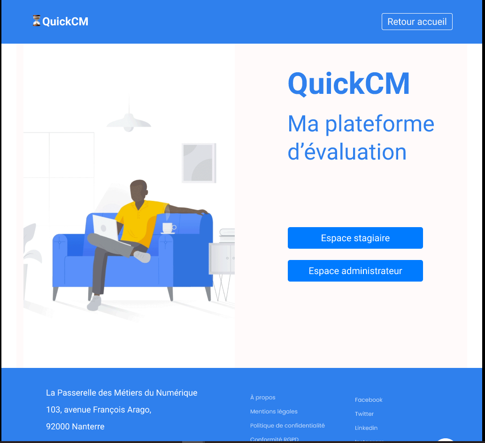
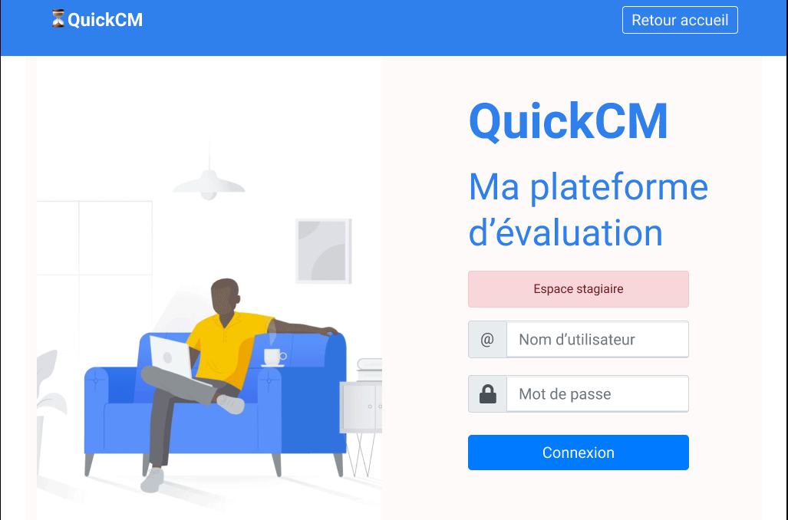
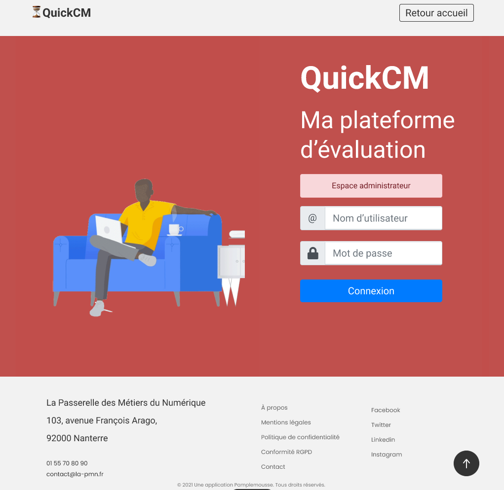

# UX Research pour QCM+

## Introduction

## Page de connexion 

Une première version a été proposée au client. 

> Page d'accueil

> Page de connexion

Celui-ci nous a rappelé la couleur etc... 

De ce fait, nous avons fait une nouvelle proposition de charte graphique afin de respecter les critères d'accessibilité et d'affordabilité : l'écran doit suggérer, par sa la manière dont il est construit, son utilisation. 

> Page de après refonte